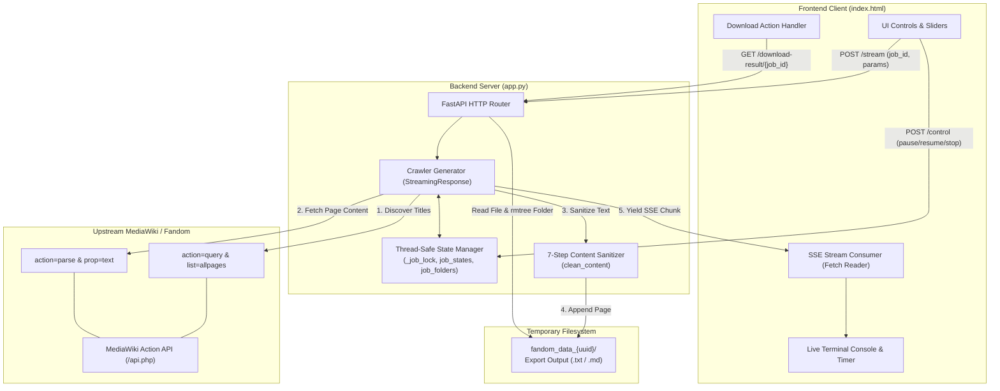

<div align="center">

# 🕷️ FallenWiki Crawler

**High-Performance MediaWiki & Fandom Extraction Engine with Real-Time SSE Streaming & 7-Step Text Sanitization.**

[](https://fastapi.tiangolo.com)
[](https://www.python.org/)
[](https://www.mediawiki.org/wiki/API:Main_page)
[](https://developer.mozilla.org/en-US/docs/Web/API/Server-sent_events)
[](LICENSE)

[**Launch the Tool**](#-accessing-and-using-the-tool) • [**Quick Start**](#-quick-start) • [**Architecture**](#-architecture--system-design) • [**7-Step Sanitizer**](#-7-step-content-cleanup-pipeline) • [**API Reference**](#-api-reference) • [**Full Wiki Docs**](#-documentation-wiki)

</div>

---

## 📖 Overview

**FallenWiki Crawler** is a lightweight, asynchronous FastAPI web application paired with an adaptive single-page frontend. It converts entire MediaWiki and Fandom wikis into clean, publication-grade **Markdown (`.md`)** or **Plain Text (`.txt`)** documents.

It is purpose-built for:
- 🧠 **LLM Fine-Tuning & Knowledge Base Construction** (Clean corpora free of web boilerplate, ads, navbars, and noise).
- 🔍 **RAG (Retrieval-Augmented Generation)** (Structured markdown headers and automatically generated Tables of Contents).
- 📚 **Offline Reading & Archival** (Compiles thousands of wiki articles into a single structured book or text export).

---

## 🚀 Quick Start & Deployment

### 1. Local Deployment (One-Click)
- **Windows**: Double-click `run.bat` (or run in cmd):
  ```cmd
  run.bat
  ```
- **macOS / Linux**:
  ```bash
  chmod +x run.sh
  ./run.sh
  ```
- **Manual Python**:
  ```bash
  pip install -r requirements.txt
  python main.py
  ```
Open **[http://localhost:8000](http://localhost:8000)** for the Landing Page or **[http://localhost:8000/crawler](http://localhost:8000/crawler)** for the Crawler Tool.

---

### 2. Cloud Deployments

- **Railway**: Connect your GitHub repository. Railway reads `railway.json` and configures builds automatically.
- **Render**: Connect repository via **New Blueprint Instance** (`render.yaml`).
- **Docker**:
  ```bash
  docker build -t fallenwiki-crawler .
  docker run -d -p 8000:8000 fallenwiki-crawler
  ```
- **Generic Cloud (Nept / Koyeb / Fly.io / Heroku)**:
  - **Build Command**: `pip install -r requirements.txt`
  - **Start Command**: `python main.py`
  - **Port**: `8000` (dynamically bound via `$PORT`)
  - **Health Check**: `/health`

---

## 🖥️ Using the Interactive Crawler Tool

```
┌──────────────────────────────────────────────────────────────────────────────┐
│  FallenWiki Crawler                           [ ☀ / 🌙 ] [ Pages: 42 / 250 ] │
├──────────────────────────────────────────────────────┬───────────────────────┤
│  CRAWLER CONTROLS                                    │  ABOUT & COMMUNITY    │
│  ────────────────                                    │  ─────────────────    │
│  Mode: [ All Pages ] [ From Links ]                  │  [ Avatar ]           │
│  Wiki Base URL: [ https://example.fandom.com      ]  │  Fallen_Archangel_    │
│  Custom Filename: [ My_Wiki_Export               ]  │  Translator & Reader  │
│  Format: [ TXT ] [ MD ]                              │                       │
│  Crawl Delay: [──────●─────] 1.0s                    │  [ Support on Patreon]│
│                                                      │                       │
│  [ ▶ Start ]  [ ❚❚ Pause ]  [ ↻ Resume ]  [ ■ Stop ] │                       │
├──────────────────────────────────────────────────────┴───────────────────────┤
│  LIVE TERMINAL CONSOLE                                                       │
│  ─────────────────────                                                       │
│  [INFO] Job started (job-9d41e2)                                             │
│  [PROC] Fetching all page titles from https://example.fandom.com ...         │
│  [OK]   Found 250 pages. Starting extraction...                              │
│  [PROC] [1/250] Fetching: Main_Page                                          │
│  [OK]   ✓ [1/250] Main_Page                                                  │
│                                                                              │
│  [ ⬇ Download .md ]                                                          │
└──────────────────────────────────────────────────────────────────────────────┘
```

### How to Use the Crawler:
1. **Select Crawl Mode**:
   - **All Pages**: Crawls every main-namespace article automatically using MediaWiki API discovery (`list=allpages` with `apcontinue`).
   - **From Links**: Provide a single page URL or upload a `.txt` file containing a list of target URLs.
2. **Configure Settings**:
   - Choose output format: **TXT** or **MD (Markdown)**.
   - Adjust the **Crawl Delay** slider (0.5s – 10.0s) to match target rate limits.
3. **Run & Monitor**:
   - Click **Start** to begin extraction.
   - Watch live Server-Sent Events stream into the color-coded console with elapsed time tracking.
   - Use **Pause**, **Resume**, or **Stop** at any time without losing processed data.
4. **Download**:
   - When complete (or stopped early), click **Download** to save your compiled export. Temporary server folders are automatically purged after download.

---

## ✨ Core Features

- ⚡ **Direct MediaWiki Action API Integration**: Interacts directly with `/api.php` (`allpages` with `apcontinue` pagination & `action=parse`) for fast, clean, and structured extraction.
- 🧹 **7-Step Text Sanitization Pipeline**: Strips navigation menus, ad placeholders, category tags, translator metadata, short junk lines, and boilerplate sections while normalizing Unicode (NFKC).
- 📡 **Real-Time SSE Streaming**: Live event streaming over Server-Sent Events with per-page counters (`[i/total]`), elapsed timers, and color-coded status logs.
- 🛡️ **Rate-Limiting & 429 Backoff**: 3-tier exponential backoff ($1\text{s} \to 2\text{s} \to 4\text{s}$) upon receiving HTTP 429 status codes, with timeout auto-recovery.
- 🔒 **Thread-Safe Multi-User Safety**: Global state protected via `threading.Lock` (`_job_lock`) with per-job scratch folders (`job_folders`), ensuring isolated multi-user sessions.
- 📑 **Automated Table of Contents**: Automatically compiles hyperlinked Markdown or structured plain-text TOCs at the top of every document.
- 🎨 **Responsive Dark/Light UI**: Centered two-column layout with customizable dark and light themes, persisted to `localStorage`.

---

## 🏛️ Architecture & System Design



---

## 🧹 7-Step Content Cleanup Pipeline

Every article passes through a strict sequential sanitization pipeline inside `clean_content()`:

```mermaid
flowchart LR
    A["Raw HTML"] --> B["HTML-to-Text<br/>Tag strip & entity decode"]
    B --> C["Step 0: NFKC Normalization<br/>Smart quotes, em-dashes, NBSP"]
    C --> D["Step 1: Nav Filter<br/>Strip 'Home', 'Wiki', 'Special pages'"]
    D --> E["Step 1b: Chapter Filter<br/>Strip 'Translator:', 'Previous chapter'"]
    E --> F["Step 2: Ad Filter<br/>Strip 'Advertisement', 'CC-BY-SA'"]
    F --> G["Step 3: Category Strip<br/>Strip 'Category: ...'"]
    G --> H["Step 4: Short Junk Strip<br/>Drop lines < 3 chars"]
    H --> I["Step 5: Blank Collapse<br/>Collapse 3+ blank lines to 1"]
    I --> J["Step 6: Section Trimming<br/>Drop 'References', 'See also', 'External links'"]
    J --> K{"Step 7: Stub Check<br/>Word count > 0?"}
    K -->|Valid| L["Write to Document"]
    K -->|Empty| M["Skip & Log Stub"]
```



---

## 🔌 API Reference

| Endpoint | Method | Content-Type | Description |
|---|---|---|---|
| `/` | `GET` | `text/html` | Serves the single-page application interface. |
| `/logo.png` | `GET` | `image/png` | Serves the author avatar/brand asset. |
| `/stream` | `POST` | `multipart/form-data` → `text/event-stream` | Initiates crawl job and streams real-time SSE progress chunks. |
| `/control` | `POST` | `application/json` | Sends control actions (`pause`, `resume`, `stop`) to an active job. |
| `/download-result/{job_id}` | `GET` | `text/markdown` / `text/plain` | Downloads the compiled export and purges the scratch directory. |

---

## 📚 Documentation Wiki

Comprehensive deep-dive guides with architecture blueprints, sequence diagrams, and protocol specifications are available in the **[`docs/wiki`](file:///docs/wiki/Home.md)** folder:

| Chapter | Document Link | Focus Area |
|:---:|---|---|
| 📖 | [**Home & Index**](file:///docs/wiki/Home.md) | Wiki directory, system highlights, quickstart. |
| 🏛️ | [**01 - Architecture & System Design**](file:///docs/wiki/Architecture-and-System-Design.md) | Concurrency model, `_job_lock`, job lifecycle state machine, Windows file locks. |
| 🔌 | [**02 - API Reference**](file:///docs/wiki/API-Reference.md) | REST specs, SSE event protocol schema, parameter tables, curl examples. |
| ⚙️ | [**03 - Crawler & Scraping Engine**](file:///docs/wiki/Crawler-and-Scraping-Engine.md) | Action API pagination, HTML-to-text converter, 7-step sanitization, 429 backoff. |
| 🎨 | [**04 - Frontend & UI Architecture**](file:///docs/wiki/Frontend-and-UI.md) | Design tokens, Light/Dark theme engine, reactive state machine, SSE reader. |
| 🚀 | [**05 - Deployment & Operations**](file:///docs/wiki/Deployment-and-Operations.md) | Installation, Linux systemd daemon, Nginx SSE buffering rules, troubleshooting. |
| 📋 | [**06 - Changelog & Technical Debt**](file:///docs/wiki/Changelog-and-Technical-Debt.md) | Historical rewrite audit, resolved race conditions, and future async roadmap. |

---

## 📁 Repository Structure

```
.
├── app.py              # FastAPI server, MediaWiki crawler engine & SSE streamer
├── main.py             # Cloud & CLI entrypoint with safe $PORT parsing
├── landing.html        # Digital Scriptorium marketing & documentation landing page
├── index.html          # Interactive single-page web UI (HTML5 / CSS3 / Vanilla JS)
├── logo.png            # Brand avatar asset
├── requirements.txt    # Production Python dependencies
├── Procfile            # Web process declaration for buildpack deployments
├── Dockerfile          # Container build definition (python:3.11-slim)
├── render.yaml         # Render Blueprint deployment configuration
├── railway.json        # Railway deployment configuration
├── run.bat             # One-click Windows local launcher
├── run.sh              # One-click Linux/macOS local launcher
├── .gitignore          # Git ignore rules for local logs, scratch files & caches
├── README.md           # Project documentation & homepage (this file)
└── docs/
    ├── README.md       # Documentation portal index
    └── wiki/           # Full Technical Wiki & Architecture Diagrams
        ├── Home.md
        ├── README.md
        ├── Architecture-and-System-Design.md
        ├── API-Reference.md
        ├── Crawler-and-Scraping-Engine.md
        ├── Frontend-and-UI.md
        ├── Deployment-and-Operations.md
        └── Changelog-and-Technical-Debt.md
```

---

<div align="center">

Made with ❤️ by Fallen_Archangel_ for readers, researchers, and LLM practitioners.

</div>
