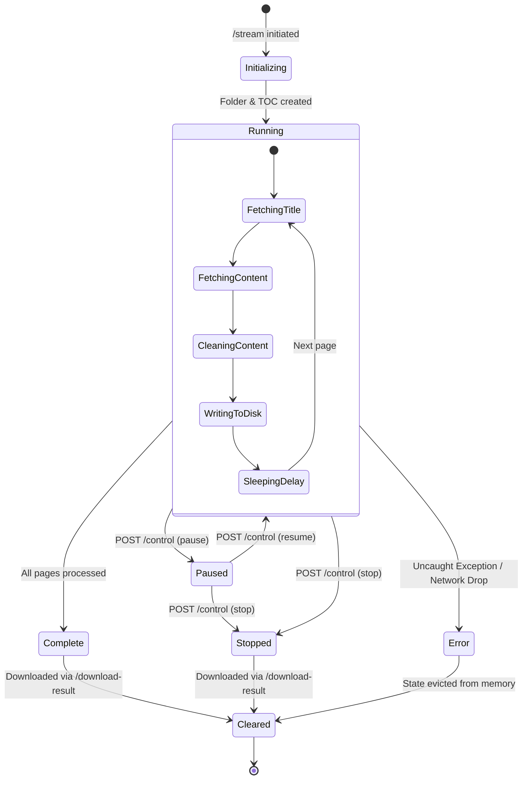
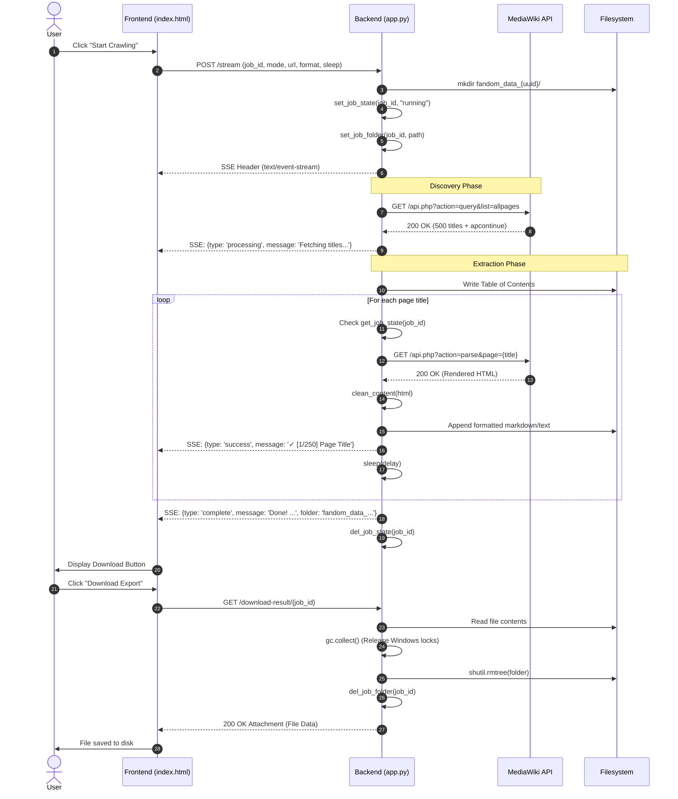

# Architecture & System Design 🏛️

This document details the architectural principles, threading model, state management, filesystem lifecycle, and data flow of **FallenWiki Crawler**.

---

## 1. System Topology

The system is built as a self-contained monolith designed for local or server-hosted single/multi-user execution. It consists of three primary layers:

1. **Frontend Presentation Layer (`index.html`)**: Reactive Vanilla JS single-page interface maintaining local state and rendering SSE stream updates.
2. **FastAPI Application Layer (`app.py`)**: Asynchronous REST endpoints, thread-safe job control registry, and synchronous streaming generators.
3. **MediaWiki Remote Target Layer**: The upstream MediaWiki/Fandom Action API (`/api.php`) serving page lists and HTML content.

```mermaid
graph TD
    subgraph Browser["Client Browser"]
        A[index.html SPA]
        A1[EventSource / fetch SSE stream]
        A2[State Store & Log Terminal]
        A3[Theme & Layout Engine]
    end

    subgraph FastAPI["FastAPI Backend (Uvicorn)"]
        B[REST Router: /, /logo.png, /control]
        C[Streaming Endpoint: /stream]
        D[Download Endpoint: /download-result/{job_id}]
        
        subgraph Concurrency["Thread-Safe Global State"]
            E[Lock: _job_lock]
            F[job_states: Dict[job_id, state]]
            G[job_folders: Dict[job_id, path]]
        end

        subgraph Worker["Crawl Execution Engine"]
            H[crawler_generator]
            I[Session Manager + Requests]
            J[clean_content Pipeline]
        end
    end

    subgraph Upstream["Target Wiki"]
        K[MediaWiki Action API]
    end

    subgraph Disk["Local Disk"]
        L[fandom_data_{uuid}/wiki_export.md]
    end

    A1 -->|POST /stream| C
    A -->|POST /control| B
    A -->|GET /download-result/{job_id}| D
    
    B --> Concurrency
    C --> Worker
    Worker <--> Concurrency
    Worker -->|query / parse| K
    Worker -->|clean & format| J
    J -->|write chunk| L
    D -->|read & rmtree| L
```

---

## 2. Concurrency & Thread-Safe Job Management

FastAPI executes asynchronous endpoints (`async def`) on the asyncio event loop while running synchronous generators (like `crawler_generator` within `StreamingResponse`) in a separate thread pool (`anyio.to_thread`).

Because `/control` is invoked from an async request while `crawler_generator` runs in a background thread, shared state must be protected against race conditions.

### Thread Synchronization Primitive

A global `threading.Lock` (`_job_lock`) serializes access to mutable registries:

```python
_job_lock = threading.Lock()
job_states = {}    # {job_id: "running" | "paused" | "stopped"}
job_folders = {}   # {job_id: "fandom_data_xxxx"}
```

### Access Helper Functions

All reads and mutations are wrapped in thread-safe helper functions:

```python
def get_job_state(job_id: str) -> str:
    with _job_lock:
        return job_states.get(job_id, "stopped")

def set_job_state(job_id: str, state: str):
    with _job_lock:
        job_states[job_id] = state

def del_job_state(job_id: str):
    with _job_lock:
        job_states.pop(job_id, None)

def set_job_folder(job_id: str, folder: str):
    with _job_lock:
        job_folders[job_id] = folder

def get_job_folder(job_id: str) -> str | None:
    with _job_lock:
        return job_folders.get(job_id)

def del_job_folder(job_id: str):
    with _job_lock:
        job_folders.pop(job_id, None)
```

---

## 3. Job Lifecycle State Machine

Each crawl job transitions through a well-defined lifecycle:



---

## 4. End-to-End Execution Flow



---

## 5. Filesystem & Storage Lifecycle

### Windows File Lock & Cleanup Handling
Under Windows OS (`NTFS`), active open file handles will prevent folder deletion and raise `PermissionError`. To ensure zero leftover orphaned directories:

1. Files are explicitly closed using context managers (`with open(...) as f:`).
2. Explicit Python Garbage Collection (`gc.collect()`) is called before folder deletion in `download_result()`.
3. Startup Garbage Collection: When `app.py` boots, it cleans any orphaned `fandom_data_*` directories from previous server interruptions:
   ```python
   for folder in [f for f in os.listdir('.') if f.startswith('fandom_data_') and os.path.isdir(f)]:
       shutil.rmtree(folder, ignore_errors=True)
   ```
