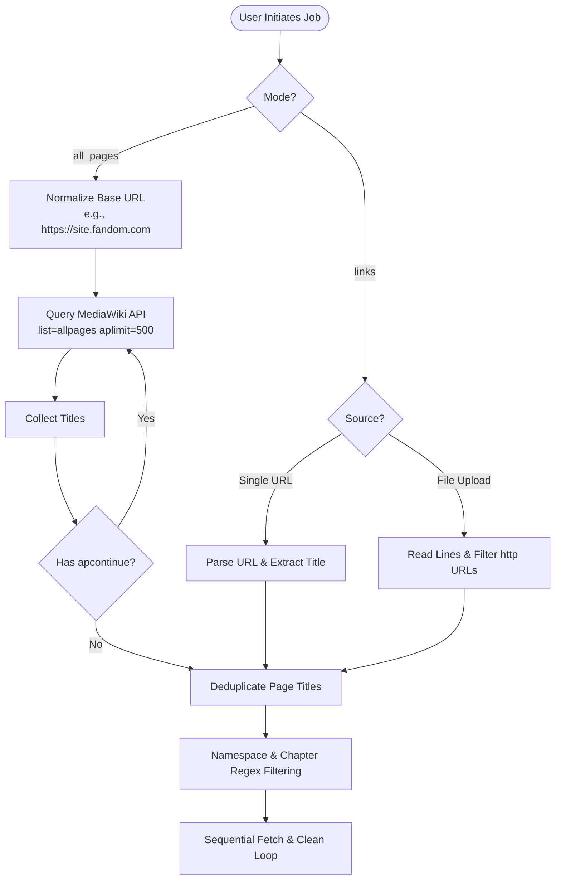
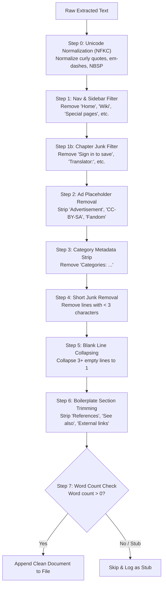

# Crawler & Scraping Engine ⚙️

This document details the crawling algorithms, MediaWiki API integration, content parsing, sanitization rules, rate-limiting resilience, and document formatting engine of **FallenWiki Crawler**.

---

## 1. Page Discovery Strategies

FallenWiki Crawler supports two distinct modes of page acquisition:

---

## 2. Namespace & Junk Filtering

Before querying article content, the crawler eliminates non-article pages and chapter stubs:

### Junk Namespaces
Titles starting with any of the following namespaces are discarded:
- `User:`, `User talk:`, `Talk:`
- `Category:`
- `File:`
- `Special:`
- `Blog:`
- `Template:`, `Module:`, `MediaWiki:`
- `Thread:`, `Message Wall:`, `Board:`, `Board Thread:`

### Chapter Noise Elimination
Web novel wikis often contain machine-translated chapter stubs. The crawler ignores titles matching:
- `^chapter[\s\d:.-]+` (e.g. *Chapter 123*)
- `chapter\s*\d+`
- `^\d{3,}` (e.g. *0012*)
- `^\d+-\d+` (e.g. *12-15*)

---

## 3. The 7-Step Content Cleanup Pipeline

---

## 4. Rate Limiting & Resilience Architecture

### Layer 1: Configurable Politeness Delay
The `sleep` parameter (default `1.0s`, configurable `0.5s`–`10.0s`) pauses execution between page requests.

### Layer 2: HTTP 429 Exponential Backoff
When encountering a `429 Too Many Requests` status:
- First retry: Waits $2^0 = 1\text{ second}$
- Second retry: Waits $2^1 = 2\text{ seconds}$
- Third retry: Waits $2^2 = 4\text{ seconds}$

### Layer 3: Redirect Loop Suppression
MediaWiki redirects are resolved automatically via `redirects=true`. If the API reports greater than 3 redirect hops, the page is flagged as a loop and safely skipped.
