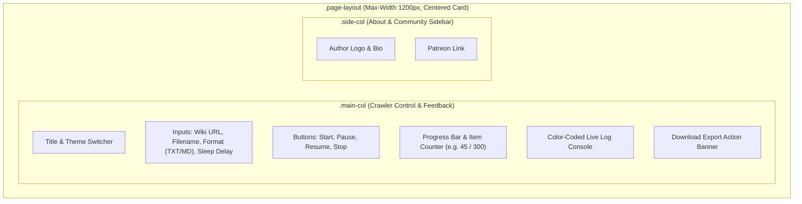
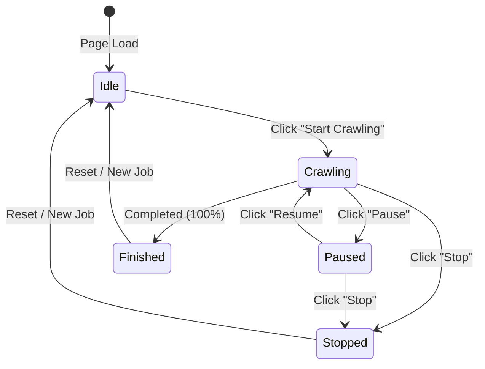

# Frontend & UI Architecture 🎨

This document describes the design system, reactive state machine, layout hierarchy, and real-time streaming engine implemented in the single-page frontend (`index.html`).

---

## 1. UI Layout Hierarchy

The interface uses a centered two-column card structure bounded by a `max-width: 1200px` container.

---

## 2. Client State Machine

