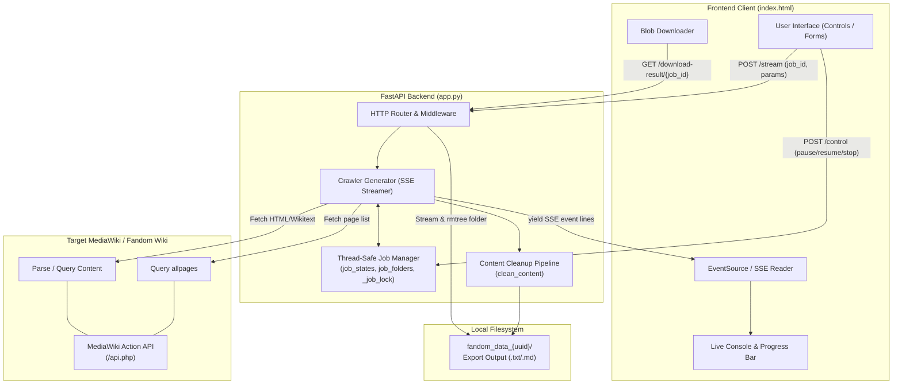

# FallenWiki Crawler Wiki 📖

Welcome to the comprehensive technical documentation and architecture wiki for **FallenWiki Crawler** (also known as *Scrapper*).

---

## 🌟 Project Overview

**FallenWiki Crawler** is a high-performance, lightweight FastAPI application paired with a modern, reactive single-page frontend. It is purpose-built to extract, sanitize, normalize, and format entire MediaWiki and Fandom wikis into clean, readable Markdown (`.md`) or plain text (`.txt`) documents suitable for LLM fine-tuning, RAG (Retrieval-Augmented Generation), offline reading, and archival.

### Key Capabilities
- 🚀 **Dual Crawling Modes**:
  - **All Pages Mode**: Automatically discovers every main-namespace article using MediaWiki's `allpages` query API with pagination (`apcontinue`).
  - **URL List Mode**: Crawls specific page lists provided via text area or file upload (`.txt` containing URLs).
- 🧹 **7-Step Text Sanitization Pipeline**: Cleans boilerplate, ads, navigation links, translator comments, empty categories, and short junk lines while preserving document integrity.
- ⚡ **Real-Time Job Control & SSE Streaming**: Live progress tracking, color-coded server logs, itemized counters, and pause/resume/stop controls over Server-Sent Events (SSE).
- 📑 **Automated Table of Contents**: Generates linked Markdown or structured Plain Text TOCs at the top of every export.
- 🛡️ **Resilience & Rate Limiting Guard**: Built-in HTTP 429 backoff retry logic, redirect loop suppression, and safe Windows file handle management.
- 🎨 **Adaptive UI**: Single-page application with responsive two-column layout, full dark/light theme support, and zero external runtime JS dependencies.

---

## 🏛️ High-Level System Architecture



---

## 📚 Wiki Contents & Navigation

Explore the technical chapters below for in-depth documentation:

| Chapter | Document | Description |
|---|---|---|
| **01** | [Architecture & System Design](file:///docs/wiki/Architecture-and-System-Design.md) | Concurrency model, thread safety, job state lifecycle, SSE streaming mechanics, and filesystem lifecycle. |
| **02** | [API Reference](file:///docs/wiki/API-Reference.md) | Comprehensive specification for all REST and Streaming endpoints, SSE event protocol, payload formats, and error codes. |
| **03** | [Crawler & Scraping Engine](file:///docs/wiki/Crawler-and-Scraping-Engine.md) | Deep dive into MediaWiki Action API interaction, URL normalization, 7-step sanitization pipeline, and rate limiting logic. |
| **04** | [Frontend & UI Architecture](file:///docs/wiki/Frontend-and-UI.md) | Client-side state machine, design tokens, light/dark theme system, SSE parser, and dynamic progress bar. |
| **05** | [Deployment & Operations](file:///docs/wiki/Deployment-and-Operations.md) | Quickstart, installation, environment variables, startup cleanup hooks, OS considerations, and operational troubleshooting. |
| **06** | [Changelog & Technical Debt](file:///docs/wiki/Changelog-and-Technical-Debt.md) | Architecture evolution, bug resolutions (thread safety, race conditions, file leaks), and future optimization roadmap. |

---

## 🚀 Quick Start in 60 Seconds

```bash
# 1. Install dependencies
pip install fastapi uvicorn requests

# 2. Start the server
python app.py

# 3. Open in your browser
# Navigate to http://localhost:8000
```
